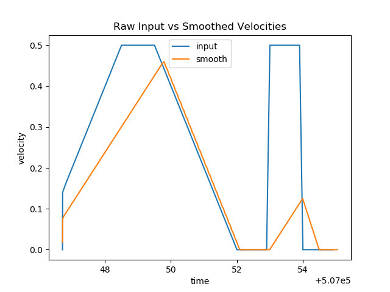

# Velocity Smoother

[[About](#about)][[Parameters](#parameters)][[Topics](#topics)][[Usage](#usage)][[Feedback](#feedback)]

## About

ROS2 package for smoothing commanded velocities represented by a stream of
`geometry_msg/Twist` messages. It applies limits to linear and angular
components of both speed and acceleration. Feedback from either
the odometry / actual commanded velocity can be used to provide
a better result in some situations (read further below).

## Parameters

* **~accel_lim_v** (double, default: 0.8): linear acceleration limit
* **~accel_lim_w** (double, default: 5.4): angular acceleration limit
* **~speed_lim_v** (double, default: 0.3): linear velocity limit
* **~speed_lim_w** (double, default: 3.5): angular velocity limit
* **~decel_factor** (double, default: 1.0): multiplier for the acceleration limit when decelerating
* **~frequency** (double, default: 20.0): computed and published rate, adhered to regardless of the incoming message rate (interpolates when necessary)
* **~feedback** (int, default: 0): the type of feedback to use (0 - none, 1 - odometry, 2 - actual commanded velocities)

## Topics

Subscriptions

* **~/input** (`geometry_msgs/Twist`): input velocity commands
* **~/feedback/odometry** (`nav_msgs/Odometry`): topic for odometry feedback, only required if the requested feedback has been set for odometry
* **~/feedback/cmd_vel** (`geometry_msgs/Twist`): topic for actual commanded velocity feedback, only required if the requested feedback has been set for actual commanded velocities

Publications

* **~smoothed** (`geometry_msgs/Twist`): smoothed output velocity commands respecting velocity and acceleration limits

## Usage

* All the parameters except frequency are dynamically reconfigurable.
* Linear and angular velocities are smoothed proportionally to the more restricted, so we guaranty a constant rotation radius.
* If the input topic gets inactive, and the last command is not a zero-velocity one, (maybe the controller crashed, or just forgot good manners...), we introduce a fake zero-velocity command after a sort timeout.

Simply wire up the channels to their appropriate topics. The tests can be a useful starting point.

## Feedback

There are some reasons to use robot feedback. The two most frequently faced:

* Multiple controllers compete for controlling the robot via a multiplexer. A controller that has been excluded by another with higher priority may suddenly issue commands significantly different to the
last commanded velocity when the multiplexer has switched back to it. i.e. the commanded velocity
profile experiences a large, discrete jump. In these cases, option 2 is very useful. 
* The robot fails to generate the commanded velocity due to, for example, unmodelled inclines, carpets etc. In these cases, option 1 is very useful.
